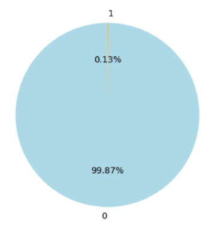
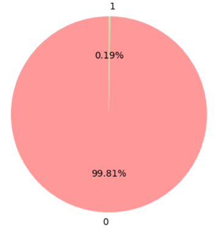
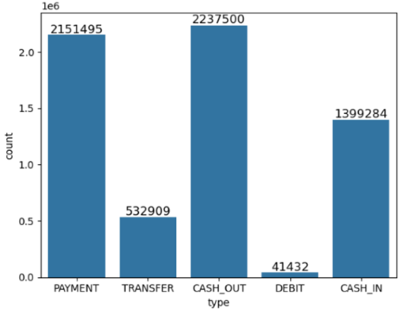
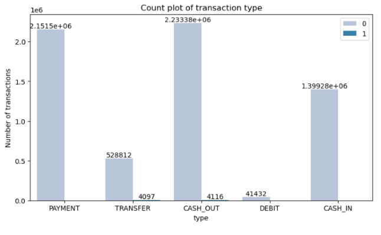
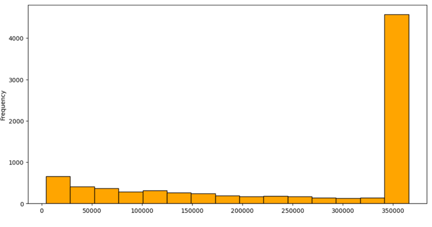

# Online Payment Fraud Exploratory Data Analysis 

## Project Overview

A Portuguese bank has recently run a campaign to attempt to sell a new product to customers over the phone. The product is a term deposit, where customers deposit their money for a fixed period of time for a fixed interest rate. They want to analyze the results of this campaign to understand what makes customers likely to buy this particular product.The CEO has requested the data analytics team to explore the data and use machine learning to build a model to predict whether a customer is likely to buy.

## Table of Contents
1. [Problem Definition](#problem-definition)
2. [Data Collection](#data-collection)
3. [Exploratory Data Analysis](#exploration-data-analysis)
4. [Conclusions](#conclusions)

## Problem Definition
- Problem Statement
  - Develop predictive model using KNN classification to predict whether a customer will purchase a banking product marketed over the phone.

## Data Collection
- **Dataset Source**:
  - https://www.kaggle.com/datasets/jainilcoder/online-payment-fraud-detection

  
## Exploratory Data Analysis

1. What percentage of the total transactions are fraudulent?
   
   A total of 8,213 (out of 6,354,407) fraudulent transactions occurred, making up approximately 0.13% of all transactions.

    

2. Were we able to flag the fraudulent transactions as 'isFlaggedFraud'?

   No, only 16 out of 8213 fraudulent transactions were flagged as fraudulent, which represents just 0.195% of the total fraud transactions.

    
    
3. What types of online transactions are available, and which are the most common?

   Payment, transfer, cash out, debit and cash in. Payment and cash out are the most common.

   

4. Which payment transfer type is most affected by fraud?
   
   Fraud has occurred exclusively in the 'cashout' and 'transfer' payment types. Specifically, 0.183% (4116 / 2233384) of transactions in the 'cashout' mode were fraudulent, while 0.769 (4097/528812) of transactions in the 'transfer' mode were fraudulent.

   
  
5. Are all the transactions marked as 'isFlaggedFraud' correctly identified as fraud?

   Yes, all 16 transactions flagged as fraud are indeed fraudulent

   
  
8. What is the amount range for fraudulent transactions?
   
   Fraudulent transaction amounts range from ₹1.3 lakh to ₹3.6 lakh, with the highest frequency occurring in the ₹3.4 lakh to ₹3.6 lakh range.

   

## Conclusions

Both models perform better than baseline. However, model 1 has higher accuracy and ‘True Positive’ cases than Model 2. In other words, Model 1 can correctly label a true subscriber to be a subscriber.

Further analysis should be done on ‘False Negative’ cases as this group of customers are subscribers, however, they were predicted wrongly by the model. ‘False positive’ cases can be ignored as these customers are non-subscribers.

